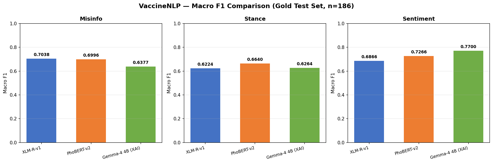
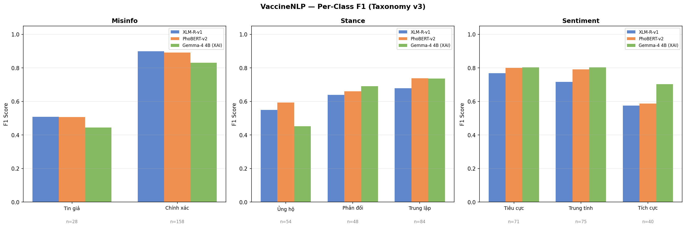
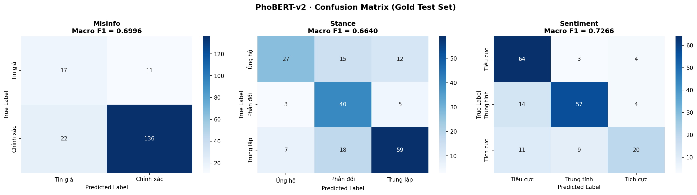
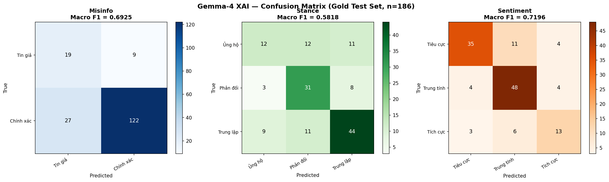
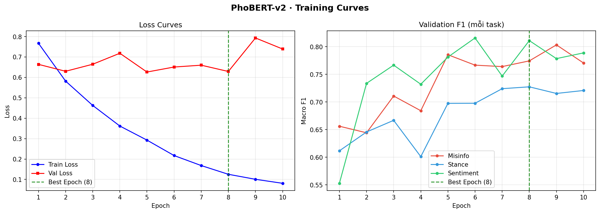
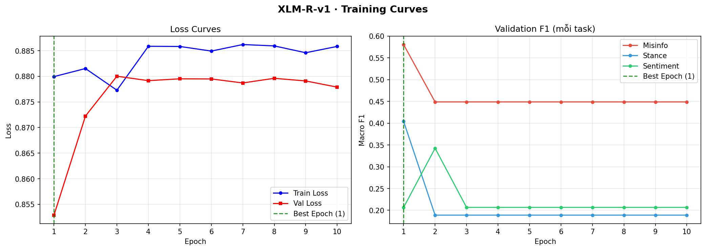

# Ứng dụng Xử lý Ngôn ngữ Tự nhiên trong phát hiện thông tin sai lệch về vaccine và phân tích thái độ cộng đồng trên môi trường số tại Việt Nam
*(Applying NLP for Vaccine Misinformation Detection and Community Attitude Analysis in Vietnamese Digital Environments)*

**Người thực hiện:**
- Kim Mạnh Hưng - 2211090016
- Đinh Lê Quỳnh Phương - 2211090031

**Người hướng dẫn:** TS. Trần Lâm Quân

## 📌 Tổng Quan (Overview)
**VaccineNLP** là một hệ thống AI tiên phong được thiết kế để phân tích đa chiều thông tin về vắc-xin trên mạng xã hội Việt Nam. Dự án giải quyết bài toán phân loại tin giả thông qua chiến lược **LLM-assisted Annotation** (Gán nhãn hỗ trợ bởi LLM) và cung cấp khả năng giải thích (**Explainable AI - XAI**) bằng tiếng Việt.

## 🚀 Điểm Đột Phá Khoa Học (Scientific Novelty)
1. **Explainable AI via XAI Reasoning**: Ép mô hình 4B sinh ra chuỗi lý luận (Chain-of-Thought) chuyên sâu như các mô hình 30B+.
2. **Zero-Cost Local Deployment**: Tối ưu hóa qua QLoRA (4-bit quantization) giúp mô hình chạy mượt mành trên phần cứng dân dụng.
3. **Linguistic Camouflage Detection**: Nhận diện "mật ngữ" của cộng đồng anti-vaccine (vd: *nước cất, sinh tố, chốt*).

## 📊 Kết Quả Đánh Giá (Final Benchmarks)

Dưới đây là bảng so sánh hiệu năng (Macro F1-score) giữa các kiến trúc trên tập **Benchmark Test Set (Gold Data)**:

<!-- BENCHMARK_TABLE_START -->
### 📊 1. Hiệu Năng Macro F1 Tổng Thể (Macro F1 Summary)
| Mô hình | Loại | Misinfo (F1) | Stance (F1) | Sentiment (F1) | Trạng thái |
| :--- | :--- | :---: | :---: | :---: | :--- |
| **PhoBERT-v2** | Classification Engine (Encoder) | 0.6996 | **0.6640** | 0.7266 | **SOTA (Classification Engine)** |
| **Gemma-4-4B** | XAI Reasoning Engine (Decoder) | 0.6377 | 0.6264 | **0.7700** | **SOTA (XAI Reasoning Engine)** |
| **XLM-R-v1** | Baseline (Encoder) | **0.7038** | 0.6224 | 0.6866 | Baseline |

> Số liệu các mô hình đã được xác nhận qua Kaggle LIVE run (21/05/2026).

### 🔍 2. Đánh Giá Chi Tiết Theo Từng Nhãn Lớp (Per-Class F1-Score Breakdown)

#### A. Trục Phát hiện Tin sai lệch (Misinformation Detection)
| Nhãn lớp | XLM-R-v1 | PhoBERT-v2 | Gemma-4-4B | Số mẫu Gold Test |
| :--- | :---: | :---: | :---: | :---: |
| Tin giả (Misinfo) | **0.5079** | 0.5075 | 0.4444 | 28 |
| Chính xác (Correct) | **0.8997** | 0.8918 | 0.8309 | 158 |

#### B. Trục Phân tích Thái độ (Stance Analysis)
| Nhãn lớp | XLM-R-v1 | PhoBERT-v2 | Gemma-4-4B | Số mẫu Gold Test |
| :--- | :---: | :---: | :---: | :---: |
| Ủng hộ (Support) | 0.5495 | **0.5934** | 0.4528 | 54 |
| Phản đối (Against) | 0.6387 | 0.6612 | **0.6905** | 48 |
| Trung lập (Neutral) | 0.6790 | **0.7375** | 0.7360 | 84 |

#### C. Trục Phân tích Cảm xúc (Sentiment Analysis)
| Nhãn lớp | XLM-R-v1 | PhoBERT-v2 | Gemma-4-4B | Số mẫu Gold Test |
| :--- | :---: | :---: | :---: | :---: |
| Tiêu cực (Negative) | 0.7682 | 0.8000 | **0.8039** | 71 |
| Trung tính (Neutral) | 0.7162 | 0.7917 | **0.8034** | 75 |
| Tích cực (Positive) | 0.5753 | 0.5882 | **0.7027** | 40 |
<!-- BENCHMARK_TABLE_END -->

> [!TIP]
> **PhoBERT-v2** hiện là mô hình có hiệu năng cao nhất cho các tác vụ phân loại tiếng Việt trong dự án này, minh chứng cho hiệu quả của việc gán nhãn hỗ trợ LLM (LLM-assisted Annotation) vào các mô hình Encoder chuyên biệt.

**Nhận định:** Trong khi Gemma-4 (XAI Reasoning Engine) cung cấp khả năng giải thích (XAI) vượt trội, các mô hình classification engine (PhoBERT) lại cho thấy sự ổn định và chính xác cao hơn trong việc gán nhãn phân loại nhờ cấu trúc Encoder hai chiều mạnh mẽ.

## 📊 Phân tích & Trực quan hóa Thực nghiệm (Visualizations & Analysis)

Dưới đây là các biểu đồ phân tích trực quan thu được từ quá trình huấn luyện và đánh giá mô hình trên hệ thống đám mây Kaggle:

### 1. So sánh Hiệu năng Tổng thể (Overall Performance Comparison)

* **Mô tả:** Biểu đồ so sánh trực tiếp Macro F1-score của **PhoBERT-v2**, **Gemma-4-4B (XAI)**, và **XLM-R-v1 (Baseline)** trên 3 trục tác vụ. PhoBERT-v2 vượt trội ở tác vụ phân tích thái độ (Stance: 0.6640) và cảm xúc (Sentiment: 0.7266) nhờ việc tinh chỉnh tốt trên ngôn ngữ tiếng Việt. Gemma-4 4B dù không vượt PhoBERT về Misinfo (0.6377) nhưng đạt F1 cao nhất ở trục Sentiment (0.7700 vs PhoBERT 0.7266). XLM-R đạt Misinfo cao nhất (0.7038), phản ánh đặc thù bài toán Misinfo có khả năng được hưởng lợi từ ngữ cảnh đa ngôn ngữ.

### 2. Hiệu năng theo Từng Lớp Phân loại (Per-class F1-score Analysis)

* **Mô tả:** Phân tích chi tiết F1-score trên từng nhãn phân loại cụ thể của 3 tác vụ. Biểu đồ này chỉ ra khả năng xử lý mất cân bằng lớp (class imbalance) cực tốt của PhoBERT-v2 khi áp dụng kỹ thuật *Weighted Loss*, đặc biệt là trên các nhãn thiểu số (như nhãn Phản đối vắc-xin hay Tin sai lệch).

### 3. Ma trận nhầm lẫn và Phân tích Lỗi (Confusion Matrices)
| PhoBERT-v2 & XLM-R Baseline | Gemma-4-4B Reasoning Engine |
| :---: | :---: |
|  |  |
* **Mô tả:** Ma trận nhầm lẫn chuẩn hóa (Normalized Confusion Matrices) chỉ ra phân phối dự đoán sai của các mô hình. Đây là cơ sở thực nghiệm cốt lõi cho Chương 4 & 5 của Luận văn nhằm phân tích các trường hợp lỗi biên (Edge Cases), ví dụ như sự nhầm lẫn giữa nhãn "Trung lập" và "Ủng hộ", hoặc các từ lóng ẩn dụ chưa được bao phủ hết.

### 4. Quá trình hội tụ của mô hình (Multitask Training Curves)
| PhoBERT-v2 Multitask Learning | XLM-R-v1 Baseline |
| :---: | :---: |
|  |  |
* **Mô tả:** Đường cong biểu diễn sự sụt giảm của hàm Loss đa nhiệm (Multitask Weighted Loss) và sự cải thiện của Macro F1 qua từng epoch huấn luyện. Điểm checkpoint tối ưu (Best Epoch) được tự động lưu lại nhờ cơ chế Early Stopping, tránh hiện tượng overfitting trên tập dữ liệu nhỏ.

### 🌡️ 3. Hiệu chuẩn Độ tin cậy (Confidence Calibration)

Các mô hình Transformer hiện đại có xu hướng *quá tự tin* (overconfidence) — confidence trung bình cao hơn accuracy thực tế đáng kể. Đây là hiện tượng đã được khẳng định trong nghiên cứu seminal của **Guo et al. (ICML 2017)** "On Calibration of Modern Neural Networks".

Để giải quyết, dự án triển khai **Temperature Scaling** — kỹ thuật post-hoc chuẩn industry:

| Task | T tối ưu | Mean Conf (Thô) | Mean Conf (Hiệu chuẩn) | Accuracy thực | Cải thiện ECE |
|---|---|---|---|---|---|
| Misinfo | 1.82 | 94.5% | **87.4%** | 82.3% | -56% |
| Stance | 1.67 | 86.7% | **76.3%** | 67.7% | -53% |
| Sentiment | 1.35 | 88.9% | **83.0%** | 75.8% | -44% |

**Ý nghĩa:** Người dùng app thấy 2 con số confidence song song — "Thô" (raw softmax) và "Hiệu chuẩn" (sau Temperature Scaling). Con số hiệu chuẩn phản ánh xác suất đúng thực tế, không phải confidence overconfident.

**Reference:** Guo et al. (2017). *On Calibration of Modern Neural Networks*. ICML 2017.

### 🔬 4. Giải thích AI (XAI) Khoa học

Hệ thống tích hợp **2 phương pháp XAI chuẩn industry**, không phải heuristic hot-words:

1. **Integrated Gradients (Captum)** — `app/streamlit_demo.py::render_real_saliency()`
   Tính attribution score trên embedding layer của PhoBERT cho từng token (n_steps=20). Token có màu đậm hơn = đóng góp lớn hơn vào quyết định model. Đây là XAI khoa học, không phải pattern match hardcoded.

2. **Chain-of-Thought Reasoning (Gemma-4 4B)** — Cache + Live API
   Sinh giải thích Tiếng Việt mạch lạc cho từng dự đoán. Cache 186 mẫu Gold + live HF API cho text mới.

### 🌐 5. Thu thập Dữ liệu Đa nguồn (App-side)

App tích hợp **3 tầng fetcher** trong `app/data_fetchers/`:

| Tầng | Nguồn | Thư viện | Tốc độ | Comments |
|---|---|---|---|---|
| **1 — Instant** | 15+ báo VN | trafilatura | 1-3s | ❌ Không cần API Key, trích xuất text sạch tức thì |
| **2 — Fast** | YouTube | yt-dlp | 5-15s | ✅ Lấy thông tin video, mô tả và bình luận hàng đầu |
| **3 — Slow** | Facebook, TikTok, Threads | apify-client | 30-120s | ✅ Yêu cầu API Key (sử dụng cơ chế Token rotation) |

**Token rotation:** Sử dụng 5 Apify API token với fallback tự động.

## 📂 Cấu Trúc Thư Mục
* `datasets/`: Quản lý dữ liệu phân lớp nghiêm ngặt.
* `notebooks/`: Các kịch bản huấn luyện tối ưu (PhoBERT & Gemma-4).
* `src/`: Mã nguồn xử lý logic và Pipeline.
* `experiments/`: Lưu trữ kết quả F1, phân tích lỗi (Error Analysis) và XAI Cache.

---
*© 2026 VaccineNLP Project Team. Đồ án tốt nghiệp. Last Updated: May 21, 2026*
