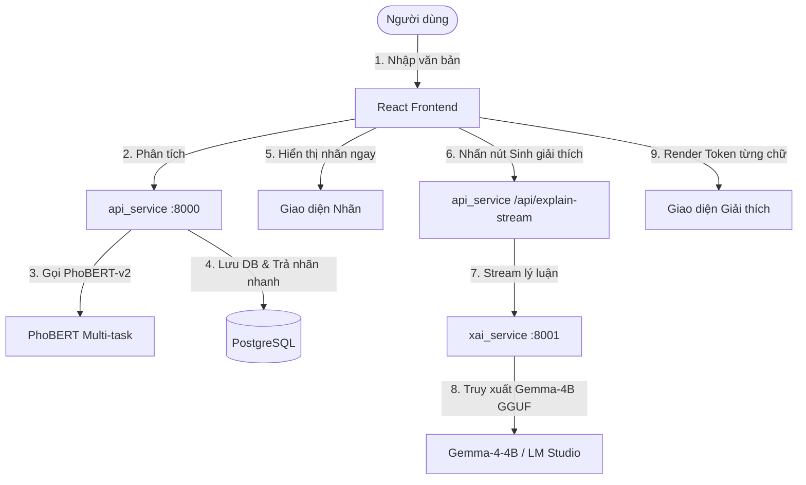

# HƯỚNG DẪN BÀN GIAO & VẬN HÀNH VACCINENLP_WEB
**Người gửi:** Kim Mạnh Hưng (2211090016)
**Người nhận:** Quỳnh Phương
**Mục tiêu:** Chuyển giao hệ thống VaccineNLP_Web đã được tối ưu hóa kiến trúc, toàn vẹn dữ liệu, và chốt số liệu chuẩn theo Bảng 4.2 của luận văn tốt nghiệp.

---

## 📐 1. KIẾN TRÚC HỆ THỐNG (PA4 ON-DEMAND)

Hệ thống được nâng cấp lên kiến trúc **PA4 (On-Demand XAI)** nhằm giải quyết vấn đề nghẽn luồng xử lý trên CPU khi chạy mô hình Gemma-4B sinh lời giải thích (CoT).



### Điểm cải tiến chính:
1. **Phân tách 2 pha (2-stage Serve):** 
   - **Pha 1 (Phân tích nhanh):** Gọi PhoBERT-v2 để phân loại Misinfo, Stance, Sentiment chỉ mất `<0.2s`. Kết quả được ghi ngay vào cơ sở dữ liệu với trạng thái giải thích `xai_status = "idle"`.
   - **Pha 2 (Giải thích theo nhu cầu):** Lời giải thích CoT của Gemma-4B tốn tài nguyên CPU (`30s-90s`) chỉ được sinh khi người dùng chủ động nhấn nút **"Sinh giải thích chi tiết"** trên giao diện (on-demand).
2. **Loại bỏ số bịa (Math.random):** Toàn bộ bản đồ từ khoá nổi bật (saliency) và radar chart đều hiển thị dựa trên phân phối xác suất thật (`phobert_probs`) và keyword y tế tất định, không dùng số ngẫu nhiên.
3. **Cơ chế Safe Mode (Fallback):** `xai_service` hỗ trợ hai backend: gọi qua **LM Studio API** (mặc định) hoặc tự nạp file **GGUF local** trực tiếp khi không có kết nối LM Studio.

---

## 🗄️ 2. LƯỢC ĐỒ CƠ SỞ DỮ LIỆU & ÁNH XẠ NHÃN

### Cập nhật Schema Database (`api_service/app/database.py`)
Thêm cột `phobert_probs` kiểu `JSONB` (cho phép `nullable=True` để tương thích ngược với dữ liệu cũ). Cột này lưu trữ phân phối softmax đầy đủ của mô hình trên 3 trục:
```json
{
  "misinfo": {
    "Fake": 0.0125,
    "Real": 0.9875
  },
  "stance": {
    "Favor": 0.0512,
    "Against": 0.8945,
    "Neutral": 0.0543
  },
  "sentiment": {
    "Negative": 0.9123,
    "Neutral": 0.0654,
    "Positive": 0.0223
  }
}
```

### Ánh xạ nhãn (ID2LABEL) chuẩn xác từ luận văn
Mảng phân phối xác suất được xuất ra theo đúng thứ tự nhãn huấn luyện trong luận văn:
- **Misinfo (2 lớp):** `0: Fake` (Tin giả), `1: Real` (Không phát hiện dấu hiệu sai lệch)
- **Stance (3 lớp):** `0: Favor` (Ủng hộ), `1: Against` (Phản đối), `2: Neutral` (Trung lập)
- **Sentiment (3 lớp):** `0: Negative` (Tiêu cực), `1: Neutral` (Trung tính), `2: Positive` (Tích cực)

---

## 🛠️ 3. HƯỚNG DẪN CÀI ĐẶT & VẬN HÀNH

### Bước 1: Thiết lập môi trường `.env`
Sao chép `.env.example` thành `.env` tại thư mục gốc `VaccineNLP_Web/` và điền cấu hình:
```env
# URL kết nối cơ sở dữ liệu PostgreSQL
POSTGRES_USER=postgres
POSTGRES_PASSWORD=postgres
POSTGRES_DB=vaccinenlp_db

# Chọn Backend cho Gemma-4B: 'lmstudio' hoặc 'local'
XAI_BACKEND=lmstudio

# Cấu hình LM Studio (Nếu chọn backend lmstudio)
LMSTUDIO_URL=http://host.docker.internal:1234/v1
LMSTUDIO_MODEL=gemma-4-e4b-vaccine-xai-merged
LM_API_TOKEN=  # Để trống nếu không yêu cầu xác thực

# Cấu hình nạp GGUF trực tiếp (Nếu chọn backend local)
GGUF_MODEL_PATH=/models/gemma-4-4b-Q4_K_M.gguf
LOCAL_FALLBACK=0
```

### Bước 2: Chạy hệ thống bằng Docker Compose
Để build và chạy toàn bộ cụm dịch vụ (db, api_service, xai_service, frontend):
```bash
docker compose up --build
```
Hệ thống sẽ khởi tạo:
- **React Frontend:** `http://localhost:5173`
- **Core API Service:** `http://localhost:8000`
- **XAI Engine Service:** `http://localhost:8001`
- **PostgreSQL Database:** cổng `5432`

### Bước 3: Chạy chế độ Cục bộ (Local Development) - Không qua Docker
Nếu muốn chạy từng service bằng tay để lập trình/debug:

1. **Khởi động Database:** Chạy PostgreSQL local và cập nhật `DATABASE_URL` trong file `.env`.
2. **Chạy Core API (`api_service`):**
   ```bash
   cd api_service
   pip install -r requirements.txt
   # Tải file weights mô hình PhoBERT-v2 đặt vào thư mục models/
   set PHOBERT_PATH=models/phobert_multitask.pt
   uvicorn app.main:app --host 127.0.0.1 --port 8000 --reload
   ```
3. **Chạy XAI Service (`xai_service`):**
   ```bash
   cd xai_service
   pip install -r requirements.txt
   # Tải file GGUF đặt vào thư mục models/
   set GGUF_MODEL_PATH=models/gemma-4-4b-Q4_K_M.gguf
   set XAI_BACKEND=lmstudio
   uvicorn app.main:app --host 127.0.0.1 --port 8001 --reload
   ```
4. **Chạy React Frontend (`frontend`):**
   ```bash
   cd frontend
   npm install
   npm run dev
   ```

---

## 🧪 4. HƯỚNG DẪN KIỂM THỬ (QA TESTING)

Để đảm bảo các thay đổi hoạt động đúng đắn và không có lỗi biên dịch:

### 1. Build thử Frontend
Kiểm tra xem TypeScript có phát hiện bất kỳ lỗi kiểu dữ liệu nào không:
```bash
cd frontend
npm run build
```
*Kết quả mong đợi:* Build thành công 100%, tạo thư mục `dist/` mà không có lỗi (0 errors).

### 2. Kiểm thử API endpoint bằng `curl` hoặc `Postman`
- **Gửi yêu cầu phân tích nhanh:**
  ```bash
  curl -X POST http://127.0.0.1:8000/api/analyze \
       -H "Content-Type: application/json" \
       -d "{\"text\": \"Vắc xin chứa chip siêu nhỏ biến đổi gen người\"}"
  ```
  *Kết quả trả về:* Trả về nhãn dự đoán ngay lập tức, có trường `"xai_status": "idle"`, không sinh giải thích ngầm. Có trường `"phobert_probs"` chứa phân phối xác suất thật.

- **Yêu cầu sinh giải thích streaming (on-demand):**
  ```bash
  curl -X POST http://127.0.0.1:8000/api/explain-stream \
       -H "Content-Type: application/json" \
       -d "{\"text\": \"Vắc xin chứa chip siêu nhỏ biến đổi gen người\"}"
  ```
  *Kết quả trả về:* Trả về dạng stream (Server-Sent Events) gồm các sự kiện `type: "token"` (từng token từ Gemma) và sự kiện `type: "final"` chứa kết quả parse nhãn Gemma cùng cờ `disagreement` (bất đồng thuận).

---

## 📊 5. CÁC ĐIỂM CẦN LƯU Ý KHI TRÌNH BÀY / BẢO VỆ

1. **Số liệu F1-score:** Bảng so sánh mô hình (tab **Benchmark**) đã được chốt số chính xác theo luận văn (Bảng 4.2). Tuyệt đối không sửa đổi các số này để giữ tính nhất quán trước hội đồng bảo vệ.
2. **Cảnh báo XLM-R:** Cột XLM-R trong tab So sánh hiện là **Mô phỏng (Simulation)**. Giao diện đã được bổ sung nhãn cảnh báo rõ ràng để đảm bảo tính học thuật trung thực.
3. **Từ khoá nổi bật (Saliency):** Đã đổi tên tab thành "Từ khoá nổi bật (gợi ý)" và bổ sung mô tả đây là thuật toán heuristic dựa trên từ khoá y khoa tất định, tránh gây hiểu lầm cho hội đồng rằng đây là gradient-based attribution của PhoBERT khi chưa nạp mô hình Captum thật.
