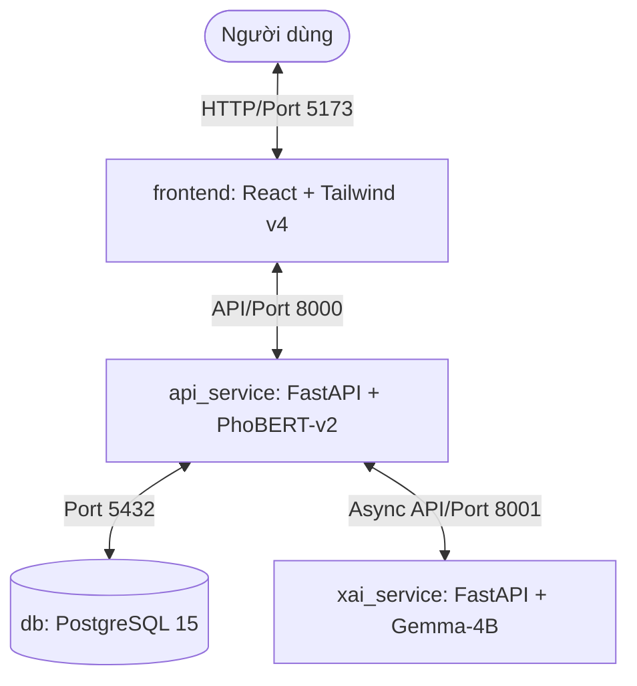

# VaccineNLP Web Platform — Web Application Upgrade (Phase 8)

Hệ thống ứng dụng Web hoàn chỉnh phân tích đa nhiệm tin tức và dư luận về vắc-xin bằng công nghệ NLP hiện đại, đóng gói toàn diện dưới dạng microservices thông qua Docker Compose.

---

## 🏗️ Kiến trúc Hệ thống

Hệ thống được thiết kế theo mô hình Microservices bao gồm 4 thành phần chính kết nối đồng bộ:



1. **`frontend` (React + Vite + TailwindCSS v4):**
   - Phục vụ giao diện người dùng thời gian thực, thiết kế theo phong cách tối giản, hiện đại (Premium Dark-mode, Bento Grid, Double-Bezel card).
   - Tương tác bất đồng bộ theo mô hình **UX 2 nhịp** để giữ trải nghiệm người dùng mượt mà nhất.
2. **`api_service` (FastAPI + PhoBERT-v2):**
   - Đóng vai trò là API Gateway chính của hệ thống, quản lý CORS và kết nối trực tiếp đến PostgreSQL database.
   - Sử dụng mô hình PhoBERT-v2 multi-task phân loại nhanh lập tức văn bản trên 3 trục: **Misinfo** (Tin giả/Không phát hiện dấu hiệu sai lệch), **Stance** (Ủng hộ/Phản đối/Trung lập), và **Sentiment** (Tích cực/Tiêu cực/Trung tính).
3. **`xai_service` (FastAPI + Gemma-4-4B GGUF):**
   - Đảm nhận tác vụ sinh lời giải thích lý luận (Chain-of-Thought) cho các nhãn đã phân loại.
   - Đóng vai trò như XAI Engine chạy ngầm thông qua hàng đợi bất đồng bộ (`BackgroundTasks`).
4. **`db` (PostgreSQL 15):**
   - Cơ sở dữ liệu chính lưu trữ lịch sử phân tích (`analysis_history`), cờ bất thường (tam giác nhãn), trạng thái XAI, và cache lời giải thích của Gemma để tối ưu tài nguyên tính toán.

---

## ⚡ Mô hình UX 2 Nhịp & Chế độ Streaming (EventStream Flow)

Để tối ưu hóa trải nghiệm người dùng trước độ trễ sinh văn bản của LLM, hệ thống hỗ trợ 2 luồng hoạt động:

### 1. Luồng truyền thống (Asynchronous Polling Flow)
* **Pha 1 (Nhịp 1 - Tức thời):** Người dùng gửi văn bản -> `api_service` dùng PhoBERT-v2 phân loại trong mili-giây -> Trả về ngay 3 nhãn phân loại kèm điểm tin cậy -> Giao diện lập tức hiển thị nhãn và chuyển trạng thái XAI sang `pending`.
* **Pha 2 (Nhịp 2 - Chạy ngầm & Polling):** `api_service` đẩy task sinh giải thích sang `xai_service` ở chế độ background -> `frontend` thực hiện tự động polling mỗi 2 giây -> Khi Gemma-4B sinh xong lời giải thích CoT, trạng thái được cập nhật thành `done` -> Frontend hiển thị đầy đủ lời giải thích lý luận và so khớp bất đồng thuận.

### 2. Luồng Streaming trực tiếp (EventStream Live-Token Flow - MỚI)
* Người dùng gửi văn bản tới đầu cuối `/api/analyze-stream`.
* Nhãn phân loại từ PhoBERT và cờ nhất quán của nhãn (`plausible` / `unusual` / `high_risk`) được trả về lập tức dưới dạng sự kiện đầu tiên (`type: "phobert"`).
* Ngay sau đó, lời giải thích lý luận CoT từ Gemma-4B (chạy qua LM Studio trên GPU host) được stream trực tiếp tới giao diện từng token một (`type: "token"`).
* Khi quá trình sinh kết thúc, sự kiện cuối cùng (`type: "final"`) trả về kết quả parse nhãn Gemma và bảng đối chiếu bất đồng thuận giữa PhoBERT và Gemma.

---

## 🏷️ Quy ước Nhãn Đa Nhiệm (Taxonomy v3)

| Trục Phân Tích | Nhãn Phân Loại |
|---|---|
| **Misinfo** (Tin tức) | `Fake` (Tin giả), `Real` (Không phát hiện dấu hiệu sai lệch) |
| **Stance** (Lập trường) | `Favor` (Ủng hộ), `Against` (Phản đối), `Neutral` (Trung lập) |
| **Sentiment** (Cảm xúc) | `Positive` (Tích cực), `Negative` (Tiêu cực), `Neutral` (Trung tính) |

---

## 🚀 Hướng dẫn Khởi chạy Dự án

### Yêu cầu hệ thống
- Máy tính đã cài đặt **Docker** và **Docker Desktop**.
- Tài nguyên khuyến nghị: Tối thiểu 8GB RAM trống (để chạy 4 container đồng thời).

### Các bước cài đặt
1. Di chuyển vào thư mục dự án `VaccineNLP_Web`:
   ```bash
   cd D:\VaccineNLP_Clean_V1\VaccineNLP_Web
   ```
2. Chuẩn bị trọng số mô hình (Không lưu trên Git):
   - Tạo thư mục `models/` tại gốc của thư mục `VaccineNLP_Web`:
     ```bash
     mkdir models
     ```
   - Tải và sao chép 2 file trọng số thật vào thư mục này:
     - **gemma-4-4b-Q4_K_M.gguf** (tải từ HuggingFace: [hung2903/gemma-4-E4B-vaccine-xai-merged](https://huggingface.co/hung2903/gemma-4-E4B-vaccine-xai-merged/resolve/main/gemma-4-e4b-it.Q4_K_M.gguf))
     - **phobert_multitask.pt** (tải từ HuggingFace: [hung2903/phobert-vaccine-multitask](https://huggingface.co/hung2903/phobert-vaccine-multitask/resolve/main/best_model.pt))
3. Khởi tạo file cấu hình môi trường `.env` (nếu chưa có):
   - Sao chép từ file `.env.example`:
     ```bash
     copy .env.example .env
     ```
   - Đảm bảo thêm khóa `LM_API_TOKEN` của bạn vào file `.env` (lấy từ settings LM Studio hoặc dùng token mặc định của hệ thống) để `xai_service` có thể xác thực khi gọi API của LM Studio trên host.
4. Chạy LM Studio trên máy chủ:
   - Đảm bảo Local Server trong LM Studio đã được bật (mặc định chạy tại cổng `1234`).
   - Nạp mô hình `gemma-4-e4b-vaccine-xai-merged` vào bộ nhớ.
5. Tiến hành build và khởi chạy các containers bằng Docker Compose:
   ```bash
   docker compose up --build -d
   ```
6. Kiểm tra trạng thái các container đang chạy:
   ```bash
   docker compose ps
   ```

### Địa chỉ truy cập
- **Giao diện Web (Frontend):** [http://localhost:5173](http://localhost:5173)
- **API Core (api_service):** [http://localhost:8000](http://localhost:8000)
- **XAI Engine (xai_service):** [http://localhost:8001](http://localhost:8001)

---

## 📁 Cấu trúc Thư mục Dự án

```plaintext
VaccineNLP_Web/
├── .env                       # Cấu hình biến môi trường cục bộ (đã gitignore)
├── .env.example               # File cấu hình môi trường mẫu
├── .gitignore                 # Bỏ qua các file bí mật/cache khi push Git
├── .dockerignore              # Bỏ qua các file thừa khi build Docker image
├── docker-compose.yml         # Cấu hình orchestration cho 4 services
│
├── models/                    # Thư mục chứa trọng số mô hình thật (đã gitignore)
│   ├── gemma-4-4b-Q4_K_M.gguf # Trọng số Gemma-4B GGUF (XAI Engine)
│   └── phobert_multitask.pt   # Trọng số PhoBERT PyTorch (Core Classifier)
│
├── api_service/               # Service phân loại chính (FastAPI + PhoBERT)
│   ├── Dockerfile
│   ├── requirements.txt
│   └── app/
│       ├── database.py        # Quản lý ORM SQLAlchemy 2.0 & PostgreSQL
│       └── main.py            # API logic và luồng 2 pha BackgroundTasks
│
├── xai_service/               # Service giải thích lý luận (FastAPI + Gemma)
│   ├── Dockerfile
│   ├── requirements.txt
│   └── app/
│       └── main.py            # Stub/Engine giải thích XAI của Gemma
│
└── frontend/                  # Giao diện người dùng (React + Tailwind v4)
    ├── Dockerfile
    ├── package.json
    ├── vite.config.ts         # Cấu hình Vite tích hợp Tailwind v4
    └── src/
        ├── index.css          # Import Tailwind CSS v4 directive
        ├── main.tsx
        └── App.tsx            # Giao diện chính xử lý polling & bất đồng thuận
```
