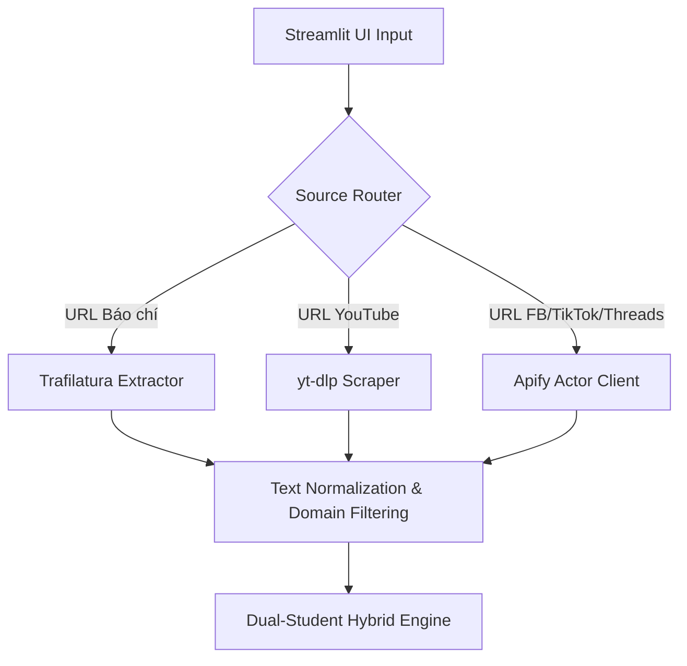

# 🏛️ Kiến trúc Pipeline Ứng dụng Xử lý Ngôn ngữ Tự nhiên trong phát hiện thông tin sai lệch về vaccine và phân tích thái độ cộng đồng trên môi trường số tại Việt Nam (Medallion Architecture)

Tài liệu này đặc tả luồng dữ liệu và cấu trúc dự án dựa trên khung tham chiếu Medallion, đảm bảo tính khoa học và minh bạch cho nghiên cứu.

---

## 1. Kiến trúc Medallion (Data Tiers)

Dữ liệu trong VaccineNLP được phân lớp theo độ tin chuẩn:

### 🥉 Tầng Bronze (Dữ liệu Thô)
*   **Đường dẫn**: `datasets/01_raw/`
*   **Nguồn**: Thu thập từ Facebook (Core), YouTube/TikTok (Low-yield/Reclaim). Đây là dữ liệu nguyên bản chưa qua xử lý.

### 🥈 Tầng Silver (Dữ liệu Làm sạch & Gán nhãn)
*   **Silver-Unlabeled** (`datasets/02_processed/`): Dữ liệu đã qua bộ lọc 3 lớp (Unicode, Teen-code, Domain filter).
*   **Silver-Labeled** (`datasets/04_silver_labels/`): Dữ liệu được gán nhãn tự động bởi **LLM annotator (31B)**. Mỗi record bao gồm nhãn 3 trục và chuỗi lý luận (XAI Reasoning) để phục vụ việc gán nhãn hỗ trợ bởi LLM.

### 🥇 Tầng Gold (Dữ liệu Vàng & Benchmark)
*   **Đường dẫn**: `datasets/03_processed/`
*   **Nội dung**: Chứa tập **Benchmark Test Set** (10%) đã được chuyên gia y tế tinh chỉnh và xác thực (Human-validated). Đây là tập dữ liệu chuẩn mực (Ground Truth) để đánh giá mọi mô hình trong Phase 5.

---

## 2. Cấu trúc Thư mục Dự án

```mermaid
graph Dir
    ROOT["VaccineNLP_Clean_V1/"]
    ROOT --> DAT["datasets/ (Medallion Data)"]
    ROOT --> SRC["src/"]
    SRC --> DP["data_pipeline/ (Archive Proof of Work)"]
    SRC --> MOD["modeling/ (Inference & Training)"]
    SRC --> COM["common/ (paths.py)"]
    ROOT --> EXP["experiments/ (MLflow & Models)"]
    ROOT --> NTB["notebooks/ (PhoBERT & Gemma QLoRA)"]
    ROOT --> DOC["docs/ (Hồ sơ học thuật)"]
```

---

## 3. Kho lưu trữ Proof of Work (src/data_pipeline/)

Để đảm bảo môi trường huấn luyện của Phase 5 "vô trùng" và không bị xung đột thư viện, toàn bộ các kịch bản thu thập (Apify) và tiền xử lý dữ liệu ở giai đoạn đầu đã được di chuyển vào `src/data_pipeline/`. 

Việc duy trì kho lưu trữ này đóng vai trò là **Proof of Work** minh chứng cho năng lực kỹ thuật trong việc xây dựng hệ thống thu thập dữ liệu tự động và quy trình làm sạch dữ liệu lớn trước khi đưa vào đào tạo AI.

---

## 4. Hạ tầng Cloud Inference (Kaggle)

Trong Phase 5, để giải quyết các hạn chế về phần cứng cục bộ (như lỗi Out-Of-Memory) khi chạy đánh giá mô hình Gemma-4 4B, dự án sử dụng **Kaggle Cloud (GPU T4 x2)** làm backend Inference. Hạ tầng này được đồng bộ với mã nguồn thông qua `kaggle kernels push` và quản lý tiến trình bằng file checkpoint `jsonl` nhằm đảm bảo khả năng phục hồi (fault-tolerant) khi quá trình chạy bị gián đoạn.

---
## 5. Kho lưu trữ Mô hình (Hugging Face Hub)

Các mô hình của dự án được lưu trữ công khai tại Hugging Face để cộng đồng có thể tái sử dụng:

| Mô hình | Loại | Link |
| :--- | :--- | :--- |
| **Gemma-4-XAI** | Reasoning Engine (Decoder) | [hung2903/gemma-4-E4B-unsloth-vaccine-xai](https://huggingface.co/hung2903/gemma-4-E4B-unsloth-vaccine-xai) |
| **PhoBERT-Multitask** | Classification Engine (Encoder) | [hung2903/phobert-vaccine-multitask](https://huggingface.co/hung2903/phobert-vaccine-multitask) |
| **XLMR-Multitask** | Baseline | [hung2903/xlmr-vaccine-multitask](https://huggingface.co/hung2903/xlmr-vaccine-multitask) |

---

## 6. Kết quả Benchmark (Tóm tắt — Nguồn: `experiments/results/*.json`)

| Mô hình | Loại | Misinfo (F1) | Stance (F1) | Sentiment (F1) |
|---|---|:---:|:---:|:---:|
| **PhoBERT-v2** | Classification Engine (Encoder) | 0.6996 | **0.6640** | 0.7266 |
| **Gemma-4-4B** | XAI Reasoning Engine (Decoder) | 0.6377 | 0.6264 | **0.7700** |
| **XLM-R-v1** | Baseline (Encoder) | **0.7038** | 0.6224 | 0.6866 |

> Chi tiết per-class breakdown xem tại `experiments/results/benchmark_report.md` và `README.md`.

## 7. Demo App: Kiến trúc Thu thập Dữ liệu Đa nguồn (Multi-Source Data Fetching Architecture)

Để ứng dụng trong môi trường thực tiễn (Wild data), Streamlit app tích hợp module thu thập dữ liệu đa nguồn thời gian thực với cấu trúc thiết kế module hóa:



### Module Đặc tả:
1.  **Trafilatura Extractor (`app/data_fetchers/news_fetcher.py`)**: Lấy text sạch từ 15+ báo lớn (VnExpress, Tuổi Trẻ, Thanh Niên) trong 1-3 giây, tự động bỏ HTML boilerplate.
2.  **yt-dlp Scraper (`app/data_fetchers/youtube_fetcher.py`)**: Sử dụng thư viện `yt-dlp` trích xuất thông tin tiêu đề, mô tả và bình luận hàng đầu của video trong 5-15 giây.
3.  **Apify Actor Client (`app/data_fetchers/apify_fetcher.py`)**:
    -   Tích hợp các Actors tối ưu: Facebook Pages Scraper, TikTok Scraper, Threads Scraper.
    -   **Cơ chế Token Rotation**: Tự động luân chuyển giữa danh sách 5 `APIFY_TOKENS` lưu tại `st.secrets` nhằm tránh rate limit và tối đa hóa băng thông cào.

---
*Cập nhật: 21/05/2026 | Phiên bản 3.1*

