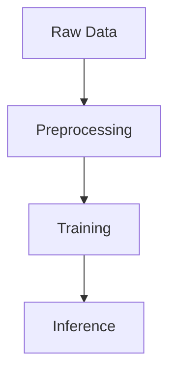

# 📚 Thư Mục Tài Liệu (docs/) - v1.1

**Cập nhật:** April 23, 2026 | Trạng thái: ✅ Complete (4 technical docs + 1 roadmap)

## Mục Đích
Lưu trữ tài liệu kỹ thuật, hướng dẫn, báo cáo khoa học và metodology cho dự án VaccineNLP.

Đây là nơi lưu trữ tất cả **học thuyết, kiến trúc, phương pháp luận, và roadmap tương lai** của dự án.

---

## 📋 Danh Sách Tài Liệu (4 Technical Docs + 1 Future Roadmap)

### 1️⃣ **01_PIPELINE_ARCHITECTURE.md** 
📌 Tài liệu kiến trúc Pipeline

**Nội dung:**
- System architecture diagram (Data Flow)
- Mỗi component (collection, preprocessing, modeling)
- Technologies & tools sử dụng
- Deployment architecture
- Scalability considerations

**Chứa:**
```
- High-level architecture overview
- Data flow diagrams (Mermaid/PlantUML)
- Component interactions
- Technology stack
- Performance benchmarks
- Deployment options (local, cloud)
```

**Sử dụng bởi:**
- Developers new to project
- System architects
- DevOps for deployment planning

---

### 2️⃣ **02_DATASET_CARD.md**
📊 Dataset Card (theo chuẩn Hugging Face)

**Nội dung:**
- Dataset overview & motivation
- Dataset statistics & distribution
- Data collection methodology
- Preprocessing applied
- Potential uses & applications
- Limitations & biases
- License & citation

**Chứa:**
```json
{
  "name": "VaccineNLP Corpus",
  "version": "1.0",
  "license": "CC-BY-4.0",
  "total_samples": 8500,
  "languages": ["vi"],
  "splits": {
    "train": 6800,
    "val": 850,
    "test": 850
  },
  "label_distribution": {
    "misinformation": 0.35,
    "safe": 0.45,
    "misleading": 0.20
  }
}
```

**Sử dụng bởi:**
- Researchers using dataset
- External collaborators
- Dataset documentation (Hugging Face Hub)

---

### 3️⃣ **03_METHODOLOGY.md**
🔬 Phương pháp luận nghiên cứu

**Nội dung:**
- Research questions
- Experimental setup
- Model architectures
- Training procedures
- Evaluation metrics & methodology
- Baseline comparisons
- Results & findings
- Limitations & future work

**Chứa:**
```
## Experimental Design
- Train/val/test splits
- Cross-validation strategy
- Hyperparameter tuning
- Statistical significance testing

## Evaluation Metrics
- Accuracy, Precision, Recall, F1
- ROC-AUC
- Confusion matrix
- CoT generation quality metrics

## Baseline Models
- Simple heuristics
- Traditional ML (SVM, Random Forest)
- Pre-trained language models (PhoBERT)

## Results
- Performance comparison tables
- Ablation studies
- Error analysis
```

**Sử dụng bởi:**
- Researchers
- Academic papers
- Peer review
- Reproducibility

---

### 4️⃣ **04_FUTURE_WORKS_XAI.md** (NEW - 23/04/2026)
🚀 Real-Time XAI Roadmap (LM Studio Integration)

**Nội dung:**
- Motivation for real-time XAI
- Proposed architecture (LM Studio backend)
- Implementation roadmap (3 phases)
- Technical specifications
- GGUF model export guide
- Streamlit integration code
- Risk mitigation strategies

**Chứa:**
```
## Phase 1: Model Export
- Merge LoRA weights (BẮT BUỘC)
- Export to GGUF (Q4_K_M quantization)
- Validate file size (~2.5-3GB for 4B model)

## Phase 2: LM Studio Setup
- Load GGUF model in LM Studio
- Configure chat template
- Set system prompt
- Enable GPU offload
- Resource capping

## Phase 3: Streamlit Integration
- Add Live Mode toggle
- Fallback to Cache Mode
- Streaming output
- Error handling
```

**Status:** ✅ Frozen Design (Ready for post-thesis execution)

**Sử dụng bởi:**
- Future development (Phase 6+)
- Thesis committee (concept validation)
- Open-source community (deployment guide)

---

## 📖 Format & Templates

### Markdown Format
Tất cả tài liệu viết bằng **GitHub-flavored Markdown** (GFM):
- Headers (# ## ###)
- Bold, Italic
- Code blocks (```python```)
- Tables
- Diagrams (Mermaid)
- Links

### Mermaid Diagrams
Hỗ trợ các diagram loại:


---

## 📝 Writing Guidelines

### Structure
```
# Main Title
## Section 1
### Subsection 1.1
#### Subsubsection 1.1.1
- Bullet points
- Code examples
```

### Code Examples
```python
# Python example
import json
from pathlib import Path

data = json.load(open('data.json'))
```

### Tables
```markdown
| Column 1 | Column 2 | Column 3 |
|----------|----------|----------|
| Value 1  | Value 2  | Value 3  |
```

### Links
```markdown
[Link text](../relative/path.md)
[External](https://example.com)
```

---

## 🔄 Version Control

Mỗi tài liệu theo dõi versions:

```
Tài liệu              | Phiên Bản | Cập Nhật   | Author
--------------------|-----------|-----------|----------
01_PIPELINE_ARCHITECTURE.md | v2.1 | 2024-03-15 | @architect
02_DATASET_CARD.md   | v1.5 | 2024-02-28 | @data-team
03_METHODOLOGY.md    | v3.0 | 2024-03-20 | @research
```

---

## 🎯 Sử Dụng & Referencing

### Từ GitHub Pages
```bash
# Build documentation site
mkdocs build
mkdocs serve

# Access at: http://localhost:8000/
```

### Từ Jupyter Notebooks
```python
# Reference từ notebook
with open('../docs/01_PIPELINE_ARCHITECTURE.md') as f:
    print(f.read())
```

### Từ Papers/Presentations
```bibtex
@dataset{vaccinenLP2024,
  title={VaccineNLP: Explainable AI for Public Health},
  year={2024},
  url={https://github.com/...}
}
```

---

## 📊 Content Organization

### Mỗi tài liệu nên có:

1. **Title & Overview** - Mục đích chính
2. **Table of Contents** - Navigation
3. **Main Content** - Nội dung chi tiết
4. **Examples** - Code, diagrams
5. **References** - Links, citations
6. **Changelog** - Version history

---

## 🔐 Confidentiality

- ✅ Public information (methodology, architecture)
- ❌ Không lưu API keys, credentials
- ❌ Không lưu private/sensitive data
- ✅ Anonymize examples khi cần

---

## 📚 External Resources

### Tiêu chuẩn tham khảo:
- **Dataset Card:** [Hugging Face Model Card](https://huggingface.co/docs/hub/datasets)
- **Methodology:** [ML Paper Template](https://www.overleaf.com/latex/templates)
- **Architecture:** [C4 Model](https://c4model.com/)

---

## 🚀 Next Steps

Các tài liệu cần được cập nhật khi:
- ✏️ Thay đổi architecture/design
- ✏️ Thêm dataset mới
- ✏️ Update methodology/results
- ✏️ Release version mới

---

**📅 Cập nhật:** April 2026  
**📋 Quản lý:** Central documentation hub  
**🎓 Độ chi tiết:** Academic-level documentation
