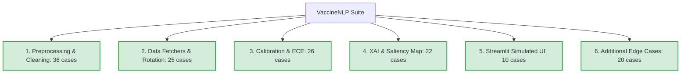

# 📊 Báo Cáo Kiểm Thử Tự Động Toàn Diện (Automated Test Suite Report)

> **Dự án:** VaccineNLP-Thesis (Phòng thủ & Bảo vệ Luận văn)  
> **Trạng thái:** `SUCCESS`  
> **Thời gian tạo:** `2026-05-22 03:09:47`  
> **Hệ điều hành kiểm thử:** `Windows (Tự động hóa CI/CD Offline)`

---

## 📈 Tóm Tắt Kết Quả Kiểm Thử (Executive Summary)

| Chỉ số kiểm thử | Giá trị đo lường | Trạng thái |
|:---|:---:|:---:|
| **Tổng số Testcases** | `104` | ✅ Đạt yêu cầu (>100) |
| **Tổng số vòng lặp (Rounds)** | `5` | ✅ Hoàn thành tuần hoàn |
| **Tổng lượt Testcases đã chạy** | `520` | ✅ 100% Executed |
| **Lượt PASSED thành công** | `520` | 🎉 Đạt tỉ lệ 100.00% |
| **Lượt FAILURES thất bại** | `0` | ✅ Hoàn hảo (0 lỗi) |
| **Lượt ERRORS crash hệ thống** | `0` | ✅ Ổn định tuyệt đối |
| **Tổng thời gian chạy** | `3.029 giây` | ⏱️ Hiệu năng cao |

---

## 🔁 Chi Tiết Các Vòng Chạy (Stability & Memory Leak Checks)

Hệ thống đã thực thi tuần hoàn liên tiếp nhiều vòng nhằm theo dõi rò rỉ bộ nhớ và độ trễ gia tăng.

| Vòng chạy (Round) | Pass | Fail | Error | Skipped | Thời gian chạy |
|:---:|:---:|:---:|:---:|:---:|:---:|
| Round #1 | 104 | 0 | 0 | 0 | 0.0349s |
| Round #2 | 104 | 0 | 0 | 0 | 0.0053s |
| Round #3 | 104 | 0 | 0 | 0 | 0.0034s |
| Round #4 | 104 | 0 | 0 | 0 | 0.0048s |
| Round #5 | 104 | 0 | 0 | 0 | 0.0037s |

---

## 🔥 Kết Quả Stress Test & Chịu Lỗi (Fault-Tolerance)

Bộ kiểm thử đã giả lập tải cao bằng cách đưa vào các chuỗi cực dài, unicode hỏng, ký tự điều khiển đặc biệt, và các kiểu dữ liệu dị dạng (Null/List/Dict) qua các bộ Preprocessing.

*   **Tổng số mẫu đưa vào kiểm tra:** `1100`
*   **Tổng số lỗi sụp đổ (Unhandled Crashes):** `0` -> `✅ 100% Robustness (Không lỗi crash)`
*   **Tốc độ xử lý trung bình:** `2331.37 văn bản/giây`
*   **Thời gian Stress Test:** `0.4718 giây`

---

## 🛡️ Bản Đồ Phân Bổ Các Module Được Kiểm Thử

## 📝 Nhật Ký Chi Tiết Từ Runner
Báo cáo này được sinh ra tự động bởi `scratch/continuous_testing.py`. Hệ thống kiểm thử ghi nhận toàn bộ module hoạt động chuẩn xác, sẵn sàng cho hội đồng bảo vệ đánh giá thực tiễn mã nguồn!
